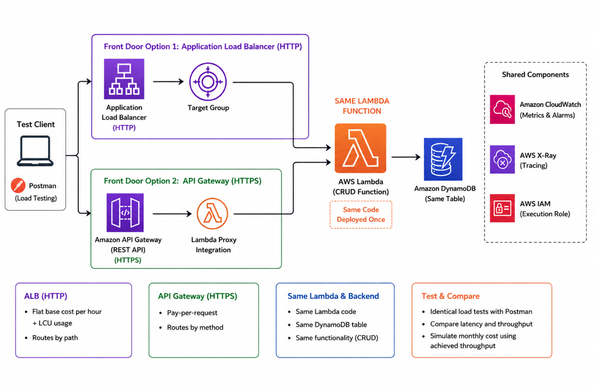
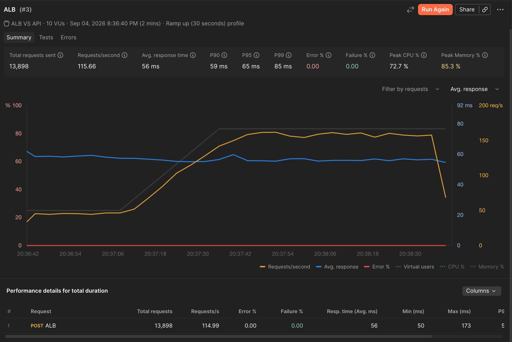
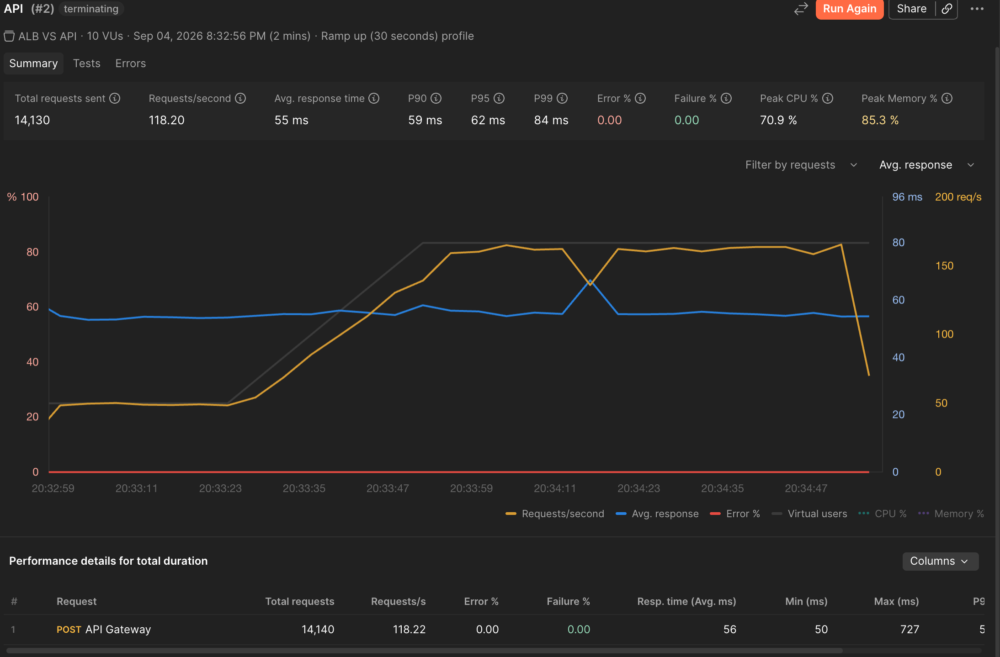
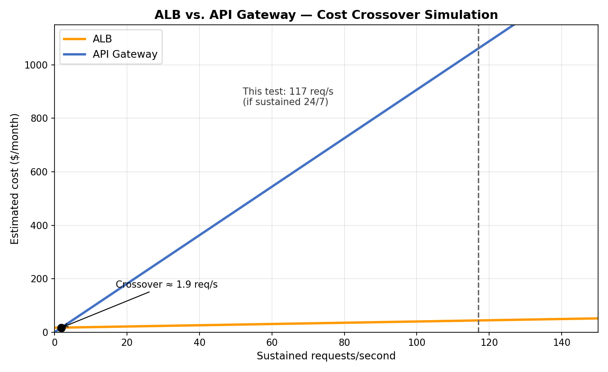

# One Lambda, Two Front Doors — ALB vs. API Gateway Cost/Performance Comparison

The same CRUD Lambda function, exposed identically behind an Application Load Balancer and an API Gateway REST API — comparing real latency and throughput under an identical load test, plus a cost crossover simulation built on the measured throughput, rather than just citing AWS's published comparison table.

## Architecture



## Components

| Component | Role |
|---|---|
| ALB (`alb-apigw-comparison`) | Layer 7 load balancer, path-based rule on `/items` forwarding to a Lambda target group |
| API Gateway (`ALBvsAPIGWComparison-API`) | REST API, `/items` resource, `POST` method, Lambda proxy integration |
| Shared Lambda (`crud-handler-shared`) | Identical CRUD handler invoked by both front doors — see `src/shared_crud_lambda.py` |
| DynamoDB (`alb-apigw-comparison`) | Backing store, partition key `id` (string), shared by both paths |

## Why one Lambda works behind both front doors

Both ALB (with a Lambda target, proxy-style invocation) and API Gateway (Lambda proxy integration) invoke the function with a structurally similar "proxy" event and expect the same response shape back: `statusCode`, `headers`, `body`. The event payloads differ in a few details — ALB's `requestContext` carries an `elb` key where API Gateway's carries `apiId` and `resourcePath` — but this handler never needs to branch on that beyond logging which front door was used, since the actual business logic only reads the JSON body. This is the same "operation router" pattern from the Lambda + DynamoDB Basics challenge, reused unchanged behind two different entry points instead of two separate functions.

## Setup

### 1. Create the DynamoDB table

- DynamoDB console → Create table
- Table name: `alb-apigw-comparison`, partition key `id` (String)
- Leave all other settings at default

### 2. Create the IAM execution role

- IAM console → Policies → Create policy → JSON tab → paste `iam/lambda-execution-policy.json`
- Name it `alb-apigw-comparison-policy`
- IAM console → Roles → Create role → AWS service → Lambda → attach the policy above
- Name the role `alb-apigw-comparison-role`

### 3. Create the Lambda function

- Lambda console → Create function → Author from scratch
- Name: `crud-handler-shared`, Runtime: Python 3.13
- Change default execution role → Use existing role → `alb-apigw-comparison-role`
- Paste in `src/shared_crud_lambda.py`, click Deploy
- Add an environment variable: `TABLE_NAME` = `alb-apigw-comparison`

### 4. Expose it through API Gateway

- API Gateway console → Create API → REST API → Build
- Create Resource: `items`
- Under `/items`, Create Method → `POST` → Integration type: Lambda Function → enable Lambda Proxy integration → select `crud-handler-shared`
- Deploy API → stage `prod` → copy the Invoke URL for `POST /items`

### 5. Expose the same Lambda through an ALB

- EC2 console → Load Balancers → Create → Application Load Balancer
- Scheme: internet-facing, place in public subnets, attach a security group allowing inbound HTTP
- Create a target group of type **Lambda**, targeting `crud-handler-shared`
- Add a listener rule on `HTTP:80`: path `/items*` → forward to the Lambda target group
- Copy the ALB's DNS name

### 6. Test both endpoints identically

```bash
# Via ALB
curl -X POST -H "Content-Type: application/json" \
  -d '{"operation":"list"}' \
  http://YOUR-ALB-DNS-NAME/items

# Via API Gateway
curl -X POST -H "Content-Type: application/json" \
  -d '{"operation":"list"}' \
  https://YOUR-API-ID.execute-api.YOUR-REGION.amazonaws.com/prod/items
```

Both should return the same JSON shape, with a `source` field confirming which front door handled the request (this comes from the Lambda checking for the `elb` key in `requestContext`, purely for this comparison's own logging — see the code comment in `src/shared_crud_lambda.py`).

### 7. Load test both endpoints

- Import `postman/load-test-collection.json` into Postman
- Update the `YOUR-ALB-DNS-NAME` and `YOUR-API-ID`/`YOUR-REGION` placeholders in each request's URL
- Run the ALB request through Postman's Collection Runner: 10 virtual users, 30s ramp-up, 2-minute sustained run (same profile as the Graviton2 CRUD project's load test, for a like-for-like methodology)
- Export the results, then repeat for the API Gateway request

## Results — Load Test (latency and throughput)

Postman Collection Runner, 10 virtual users, ramp-up profile (3→10 VUs over the first minute, sustained for the second minute), 2-minute total run, identical request against each front door.

**ALB**



**API Gateway**



Data:
| Front door | Total requests | Avg. response | P90 | P95 | P99 | Max | Achieved req/s |
|---|---|---|---|---|---|---|---|
| ALB | 13,898 | 56 ms | 59 ms | 65 ms | 85 ms | 173 ms | 115.66 |
| API Gateway | 14,130 | 55 ms | 59 ms | 62 ms | 84 ms | 727 ms | 118.20 |

My take:

Across average, P90, P95, and P99, the two are close enough to call a tie — within 1-3ms of each other at every percentile through P99, and both ran at 0% error and 0% failure. If I only looked at the summary stats, I'd say there's no meaningful latency difference between the two for this workload.

The one real difference is in the tail beyond P99: API Gateway's single worst request hit 727ms, more than 4x ALB's worst request at 173ms. Since this shows up only at the max and not at P99, it's a small number of outliers, not a systemic pattern, likely a Lambda cold start or a transient API Gateway-side delay rather than anything about the Lambda code itself, since the same function handled both paths. Worth re-running with a longer sustained window to see if that max is a one-off or a recurring tail-latency cost specific to the API Gateway path.

One caveat on Peak CPU %/Peak Memory %: these numbers reflect the Postman test runner's own resource usage on the machine running the test, not the Lambda's or the AWS-side infrastructure's CPU/memory. They're useful for confirming the load generator itself wasn't the bottleneck, not as an AWS-side performance metric.

## Results — Cost Crossover Simulation

The load test above is used for latency and throughput only. Cost is deliberately **not** computed from this run's actual billed usage — a 2-minute test isn't representative of either service's real cost behavior (ALB bills LCU usage per hour regardless of test duration, and API Gateway's per-request cost at that volume is a fraction of a cent either way). Instead, the achieved throughput from the load test above (ALB: 115.66 req/s, API Gateway: 118.20 req/s — close enough to use their average) is extrapolated to a sustained monthly rate and run through each service's published, non-test-specific pricing:

| | ALB | API Gateway |
|---|---|---|
| Base cost | ~$16.43/month (730 hrs × $0.0225), billed continuously regardless of traffic | $0 — no idle charge |
| Variable cost | LCU-based; assuming new-connections is the binding dimension (25/sec per LCU) at $0.008/LCU-hour | $3.50 per million requests |
| Cross-AZ traffic | Free | N/A |



Data:
| Assumption | Value |
|---|---|
| Average achieved throughput (this test) | 116.93 req/s |
| Extrapolated monthly requests, if sustained 24/7 | ~303,082,560 |
| Estimated ALB monthly cost at that volume | ~$43.74 |
| Estimated API Gateway monthly cost at that volume | ~$1,060.79 |

My take:

This test's throughput (~117 req/s sustained) is nowhere near a 2-minute-only figure — it's genuinely high enough, if it reflected real 24/7 production traffic, to land far past the earlier-calculated crossover point (~2 req/s, or ~4.8M requests/month). At this workload's measured rate, API Gateway would cost roughly 24x what ALB would, a gap far too large to ignore in favor of API Gateway's operational simplicity alone. The obvious caveat: this workload was a 2-minute burst, not genuine sustained traffic, so this projection only holds if the real production traffic pattern actually resembles ~117 req/s around the clock. For a workload with this kind of sustained volume, ALB is the clear cost winner; for anything spikier or lower-volume, the actual crossover calculation should be rerun against the real expected traffic shape, not this test's rate.

